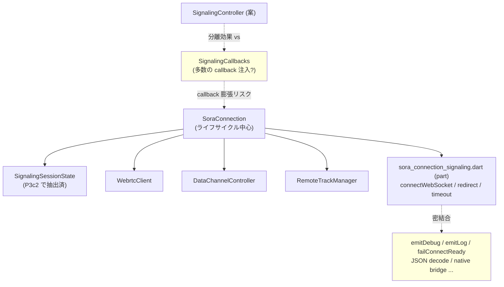

# signaling orchestration の `SignalingController` 化を保留する
- Priority: Low
- Created: 2026-04-30
- Model: GPT-5.4
- Polished: 2026-06-05

## 目的

`sora_connection_signaling.dart` に残っている signaling orchestration を `SignalingController` として `SoraConnection` から分離する案は、現時点では実施しない。P3c2 で `SignalingSessionState` の抽出までは完了したが、controller 化による分離効果より callback/context 膨張の懸念が大きいため、追加の設計検討用 pending issue として切り出す。

## 優先度根拠

- `connectWebSocket()` / `_handleWebSocketMessage()` / `_handleRedirectMessage()` は `connectReady`、`_peerConnectionConnected`、timeout/error emit、native bridge と依然として密結合している
- `SignalingSessionState` の抽出により state 依存は減ったが、orchestration そのものは `SoraConnection` のライフサイクル制御の中心に残っている
- 現状の signaling ロジックを controller 化すると、`emitDebug` / `emitLog` / `emitSignalingEvent` / `emitConnectionError` / `failConnectReady` / JSON decode helper など多くの callback や helper 注入が必要になる見込み
- `RemoteTrackManager` や `DataChannelController` と違い、signaling は接続開始・redirect・timeout・disconnect の境界にまたがっており、単独 subsystem として閉じにくい

## 現状

- `sora_connection_signaling.dart` の `part` は残っており、見た目上は P3 の完全分離が終わっていない
- ただし無理に class 化すると、`SoraConnection` と controller 間の依存が見えにくくなり、かえって保守性を落とす可能性がある
- 「`part` を消すこと」自体が目的化すると、役割分担より注入面の複雑さが増える

### 現状の責務配置と controller 化の懸念

## 設計方針

1. `SignalingController` を仮定した場合の constructor 引数と `SignalingCallbacks` の面を列挙する
2. 依存を `SignalingSessionState` + `WebrtcClient` + `DataChannelController` + 少数 callback に収められるか確認する
3. `disconnect()` / redirect / timeout の責務境界を 2〜3 文で明快に説明できるか確認する
4. callback/context が膨らむ場合は `part` 維持を正式判断として確定する

## 完了条件

- `SignalingController` 化の go/no-go 判断基準が明文化されている
- constructor 依存と callback surface が一覧化されている
- `SoraConnection` に残す責務と controller に移す責務の境界が説明できる
- 見送りの場合でも「なぜ `part` 維持が妥当か」を issue とソースコメントで説明できる

## pending 理由

P3c2 の時点で signaling 固有 state の抽出は完了しており、現状でも責務整理の効果は得られている。一方で orchestration の controller 化は、実装コストよりも依存面の複雑化リスクが大きい。現時点では費用対効果が低いため、追加設計検討用の pending issue として分離する。

## 解決方法

1. `SignalingController` 化の go/no-go 条件を明文化する
2. callback surface と依存関係を整理する
3. 必要なら `part` 維持を正式判断として記録する
