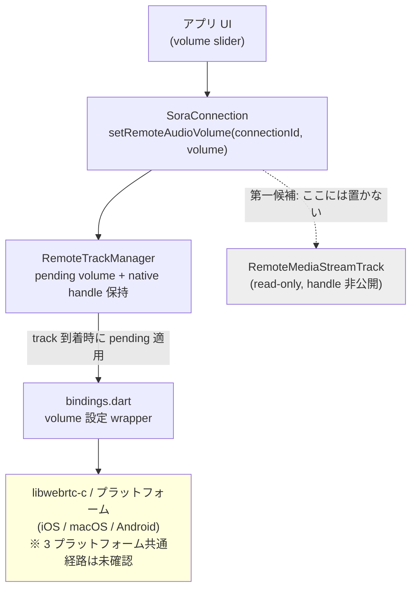

# 受信音声 volume 制御の public API を設計する
- Priority: Medium
- Created: 2026-05-13
- Model: GPT-5.5
- Polished: 2026-06-05

## 目的

現状の Sora Flutter SDK には、受信音声の再生音量を SDK 利用者が変更する public API がない。

ただし、この課題は単純な API 追加ではない。現行の remote audio public model は `RemoteMediaStream` と `RemoteMediaStreamTrack` を read-only で公開する設計であり、remote audio の native handle を Dart public API へ露出しない前提で整理されている。そのため、受信音量制御は API の置き場所、内部 state の持ち方、native 実装経路を先に設計しないと実装に着手できない。

本 issue は実装 issue ではなく、受信音声 volume 制御 API を public に提供できるか、その場合にどの形で提供するかを整理するための design issue とする。

## 優先度根拠

- 受信音量制御は利用者の UI に直結する
- ただし public API の置き場所と native 実装経路が未確定で、単純な setter 追加では済まない
- remote audio の handle 管理を伴うため、既存の read-only model と整合する設計が必要である

## 現状

- `SoraConnection` が現在公開している音声操作は `setAudioEnabled(bool)` と `isAudioEnabled` であり、これはローカル音声トラックの mute / unmute である
  - `lib/src/sora_connection.dart:214-221`
- remote 側の public model は `SoraConnection.remoteMediaStreams` と `RemoteMediaStream.audioTrack` / `videoTrack` であり、`RemoteMediaStreamTrack` は read-only な値オブジェクトである
  - `lib/src/sora_connection.dart:238-240`
  - `lib/src/sora_remote_media_stream.dart:15-23`
  - `lib/src/sora_remote_track.dart:7-25`
- 現行実装は 1 `connectionId` あたり audio track 1 本前提であり、`RemoteTrackManager` は remote audio 到着時に `connectionId` ごとの `audioTrack` スロットを上書きする
  - `lib/src/sora_remote_track_manager.dart:193-224`
  - `lib/src/sora_remote_track_manager.dart:230-267`
- FFI イベントは remote audio の追加 / 削除時にも `trackAddress` を Dart へ渡しているが、Dart 側は audio ではその handle を保持せず、`trackId` / `connectionId` だけの `RemoteMediaStreamTrack` に落としている
  - `lib/src/ffi/webrtc_client.dart:919-923`
  - `lib/src/ffi/webrtc_client.dart:952-956`
  - `lib/src/sora_remote_track_manager.dart:230-267`
- 現在の FFI binding には remote audio volume を変更する Dart API はなく、audio track 関連で公開しているのは cast / refcount / vector 操作が中心である
  - `lib/src/ffi/bindings.dart:2241-2397`
- Android 配布物の linker 設定には `AudioTrack_nativeSetVolume` が含まれるが、repo 内にそれを呼ぶ Kotlin / MethodChannel / Dart wrapper は存在しない
  - `android/src/main/cpp/webrtc.ldflags:33`
  - `android/src/main/kotlin/jp/shiguredo/sora_sdk/SoraSdkPlugin.kt:215-290`
- remote track の public API から `trackAddress` を外し、内部実装に閉じ込める方針は既に確定している（過去の trackAddress 削除 issue で対応済み）

## 本 issue の対象外

- 音声出力デバイス選択や output routing の public API
  - これは `issues/pending/0004-design-add-audio-output-device-public-api.md` の論点であり、受信音量制御とは別問題
- Android devtools 内部の `setAudioOutputDevice` MethodChannel
  - これは再生先 route 制御であり、remote audio gain 制御ではない

現行 public API で確認できる音声出力側の機能は `enumerateAudioOutputDevices()` までであり、受信音量制御とは切り分けて扱う。
- `lib/src/sora_media_devices.dart:101-108`

## 現状の問題

- SDK 利用者はアプリ内 UI から remote peer ごとの受信音量を調整できない
- OS のハードウェア音量はアプリ全体の再生音量に寄るため、接続単位のミキシングや participant ごとの音量調整に使えない
- 現行の public model では remote audio の native handle を保持していないため、単純に setter を足すだけでは実装できない

### 受信音量 API のレイヤ構成 (案)

## 設計方針

### 1. public API の責務と置き場所

現行 public model では、可変操作は `SoraConnection` に寄せ、`RemoteMediaStream` / `RemoteMediaStreamTrack` は read-only に保つ方針で揃っている。

そのため、第一候補は `SoraConnection` に受信音量制御 API を追加する案とする。

候補:

1. `void setRemoteAudioVolume(String connectionId, double volume)`
2. `double? getRemoteAudioVolume(String connectionId)`

`RemoteMediaStreamTrack` へ instance method を足す案は、現状の `RemoteMediaStreamTrack` が native handle も `SoraConnection` 参照も持たないため、第一候補にしない。

### 2. 制御粒度

現行実装は 1 `connectionId` あたり audio track 1 本前提であるため、まずは `connectionId` 単位を正式な制御粒度とする。

`trackId` 単位 API は、現行では `connectionId` 単位と実質同じであり、`RemoteMediaStream` のモデル変更なしに導入する意味が薄い。

将来、1 `connectionId` あたり複数 audio track を扱う要件が発生した場合は、別 issue で `RemoteMediaStream` / `RemoteTrackManager` / public API の前提を見直す。

### 3. volume 値の契約

第一候補は `0.0 .. 1.0` の `double` とする。

理由:

- `double` のまま native 側へ渡しやすい
- UI 表示用の `0 .. 100` はアプリ層で変換できる
- mute を `0.0` で表現できる

未決定事項:

- 範囲外入力を `RangeError` にするか、clamp するか
- `NaN` / `infinity` を reject するか
- `getRemoteAudioVolume()` を public に持つか、setter のみで十分か

### 4. state の保持ライフサイクル

現行の `_remoteMediaStreams` は track 到着時に生成され、remove 時に消える。pending volume を保持する別 state は存在しない。

そのため、実装する場合は `RemoteTrackManager` に少なくとも以下が必要になる。

- `connectionId -> pending volume` の管理
- `connectionId -> remote audio native state` の管理
- track 到着時に pending volume を適用する処理
- `disconnect()` / `dispose()` 時の state クリア
- native handle の所有権と解放責務の管理

未決定事項:

- audio track 未到着の `connectionId` に対する `setRemoteAudioVolume()` を許可するか
- remove 後に同じ `connectionId` の audio が再到着した場合、最後に設定した volume を引き継ぐか
- 対象 `connectionId` が存在しない場合に no-op / cache / error のどれにするか
- `remote_track_removed` 直後や `disconnect()` 進行中に `setRemoteAudioVolume()` が走った場合に no-op / cache / error のどれにするか
- internal state に保持する audio handle が `AddRef` 済みポインタかどうか、および `Release` をどの経路で保証するか
- callback で渡される raw な `trackAddress` をそのまま保持してよいか、保持前に明示 `AddRef` が必要か

### 5. native 実装経路

実装する場合、Dart public API 追加だけでは足りず、少なくとも以下の層を変更する必要がある。

1. `RemoteTrackManager`
   - remote audio の native handle を内部保持できる形へ変更する
2. `lib/src/ffi/bindings.dart`
   - remote audio volume 変更に必要な binding を追加する
3. `lib/src/ffi/webrtc_client.dart` または libwebrtc-c 側
   - Dart から呼べる volume 設定 API を追加する
4. プラットフォーム別配布物 / wrapper
   - iOS / macOS / Android の 3 プラットフォームで同等に呼べる経路を揃える
5. 所有権管理
   - remote audio handle を保持する場合の `AddRef` / `Release` 契約を video 側の既存管理と矛盾しない形で定義する

未確認事項:

- libwebrtc-c が iOS / macOS / Android の全てで remote audio volume 設定 wrapper を提供できるか
- Android の `AudioTrack_nativeSetVolume` 相当の足場を Apple 系でも同じ抽象で揃えられるか
- remote audio handle を Dart 側で保持する場合の所有権モデルを、既存 video track の寿命管理と同じ厳密さで定義できるか

この未確認事項が解消しない限り、本 issue を active な実装 issue へ昇格させない。

### 6. テストと検証

実装に進める場合は、最低限以下を対象にする。

- Dart unit test
  - 範囲外入力
  - dispose 後の呼び出し
  - remote audio 未到着時の挙動
  - remove / 再追加時の挙動
- integration / 実機確認
  - recvonly 接続で remote audio 再生中に volume が反映される
  - iOS / macOS / Android で同じ API 契約を満たす
- `CHANGES.md`
  - `## develop` / `### sora_sdk` にエントリを追加する

devtools / quickstart の UI 追加は必須スコープにしない。まずは SDK public API と自動テストを優先し、サンプル UI は別 commit か別 issue で扱う余地を残す。

## pending 理由

受信音量制御は API 追加だけの問題ではなく、remote audio の native state を public に露出せず保持する内部設計と、3 プラットフォームで共通に呼べる volume 設定経路の確認が必要である。

現時点でローカルソースから確認できるのは、

- public API が未提供であること
- remote audio の native handle を Dart public model が保持していないこと
- Android には関連しそうな linker symbol があること

までであり、実装着手に必要な cross-platform の足場確認が不足している。

そのため、本 issue は `issues/pending/` に置き、以下が確認できた時点で active な実装 issue へ作り直す、または reopen する。

## 完了条件

1. iOS / macOS / Android の 3 プラットフォームで利用する native volume 設定経路が確定している
2. `SoraConnection` に置く最終 API シグネチャと例外契約が確定している
3. `RemoteTrackManager` が remote audio native handle と pending volume を内部保持する設計が確定している
4. remote audio handle の所有権と `Release` 経路が確定している
5. remove / disconnect 競合時の `setRemoteAudioVolume()` 契約が確定している
6. 自動テストと実機確認の項目が確定している

## 解決方法

1. public API の置き場所と volume 契約を決める
2. remote audio handle の保持と解放経路を実装する
3. 3 プラットフォームで動作確認してから active 化する
