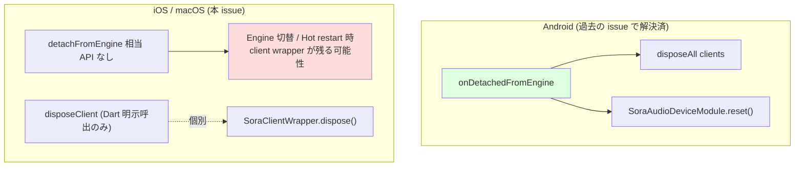

# iOS / macOS Plugin に FlutterEngine detach 相当の cleanup 経路が存在しない
- Priority: High
- Created: 2026-05-19
- Model: Opus 4.7
- Polished: 2026-06-05

## 目的

iOS / macOS の `SoraSdkPlugin` には FlutterEngine 終了経路に対する一括 dispose API が存在しない。Android は `FlutterPlugin.onDetachedFromEngine` で解決済みだが、iOS / macOS の `FlutterPlugin` プロトコルには `detachFromEngine` 系メソッドが無い。

現行コードで確認できる事実:
- `SoraFlutterMessageHandler` に全クライアントを一括 dispose する `disposeAll()` は無い
- `SoraSdkPlugin` に `detachFromEngine` 相当のフックは無い（API 不在のため）
- `SoraClientWrapper.dispose()` は個別に存在し冪等だが、呼び出し経路は Dart 側の明示 `disposeClient` のみ

ただし、iOS / macOS の FlutterPlugin に正規の detach hook が存在しない以上、Android と同等の完全な解決は不可能。

## 優先度根拠

- engine detach 時にクライアントが残る leak は運用上の影響が大きい
- ただしプラットフォーム API の制約が強く、単純な cleanup 追加では解決しない
- 代替経路の有無を先に整理しないと、実装しても再発しやすい

## 現状

- `SoraFlutterMessageHandler` に全クライアントを一括 dispose する `disposeAll()` は無い
- `SoraSdkPlugin` に `detachFromEngine` 相当のフックは無い
- `SoraClientWrapper.dispose()` は個別に存在し冪等だが、呼び出し経路は Dart 側の明示 `disposeClient` のみ

### プラットフォーム別 engine detach 経路

## 設計方針

1. iOS / macOS で利用できる cleanup 経路を洗い出す
2. `willTerminateNotification` / `didDisconnectNotification` で代替できるか確認する
3. 代替不可なら pending のままにし、再設計の前提を明確にする

## 完了条件

- 一括 cleanup の可否が明確になっている
- `detachFromEngine` 相当が無い場合の代替経路が整理されている
- engine detach 時の leak 再発条件が消えている、または pending 維持の根拠が明確である

## pending 理由

- iOS / macOS には Android の `onDetachedFromEngine` 相当の明確な hook が無い
- `willTerminateNotification` / `didDisconnectNotification` では Engine 切替や Hot restart を十分に捕捉できない
- 主問題は app terminate ではなく Engine detach 系の lifecycle 設計であり、現時点の案ではスコープを満たせない

## 関連 issue

- Android の過去の engine detach leak 修正 issue -- Android で同等の問題を解決

## 解決方法

1. iOS / macOS の lifecycle hook で対応できるか再調査する
2. 代替 cleanup 経路がなければ pending を維持する
3. 実装可能な場合のみ active issue として再作成する
